# processing_of_thermograms

The project was devoted to the analysis of thermograms. Its main function is to aid in the analysis of thermographic images, but it also works for ordinary images. The layout of the user panel looks like this:

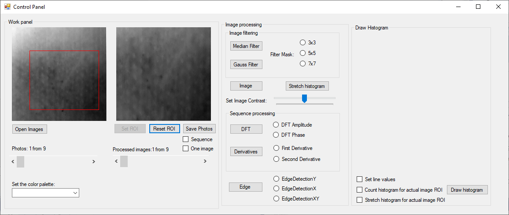

The purpose of the filters is to detect potential defects in the area shown in the photos. This is to help eliminate potential material leakage defects. Composite materials were used for the tests, which are used, for example, in aviation in the construction of aircraft. The application was designed to check which filters help to find potential defects of materials.
The available filters are:
-median filter
-gauss filter
-stretch histogram
-palette in various colors
-discrete transform Fourier
-first and second derivatives
-edge detection

Example palette of colors:

-cold colors

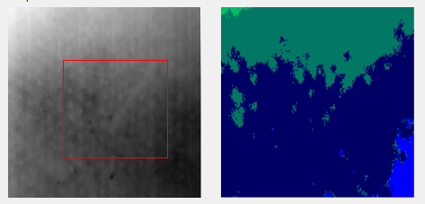

-warm colors

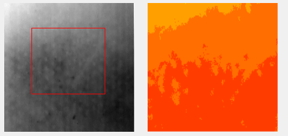

ROI- Region of Interest in image:

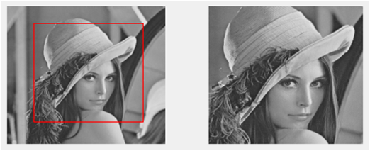

Median filter 7x7:

Gauss filter:

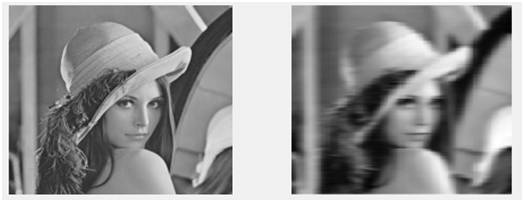

Image histogram:

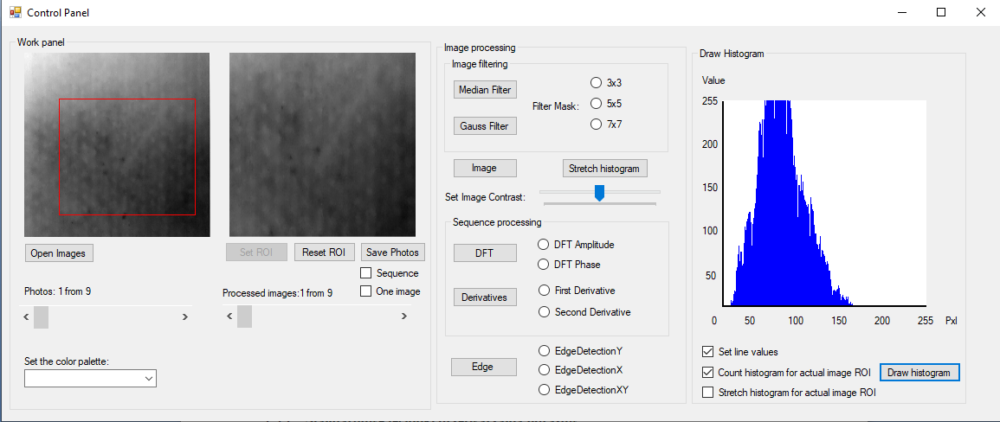

Stretch histogram in image:

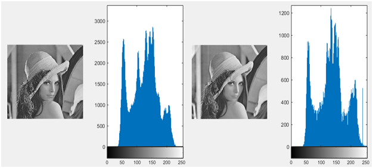

Image contrast:

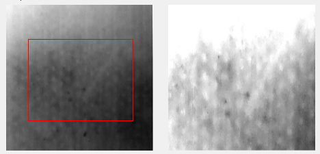

Edge detection(first on the left is X detection, second Y and last is X and Y):

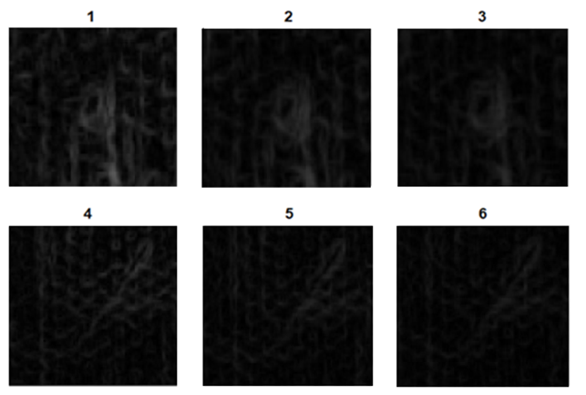

Derivatives(left is original,second used first derivatives and last used second derivatives):

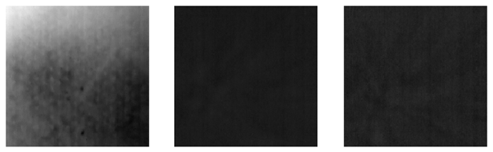

Discrete Transform Fouriere(amplitude in the middle and phase on right):

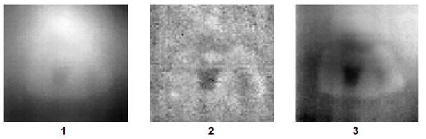
